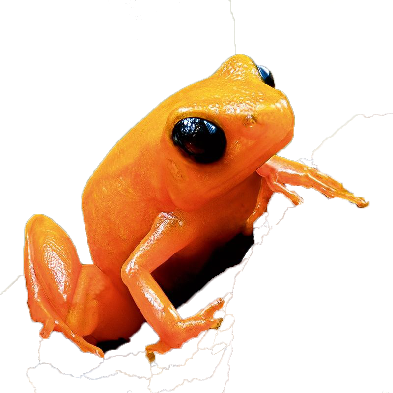

# About:
This is a repository dedicated to providing knowledge about different types of frogs (some toads). A frog is any member of a diverse and largely carnivorous group of short-bodied, tailless amphibians composing the order **Anura** ( *without tail* in ancient greek). There are about 5,000 total **Anura** species. 

# Interesting Facts:
- [Frogs dont need to drink water because they can absorb it through their skin](https://onekindplanet.org/animal/frog/)
- [One gram of the toxin produced by the skin of the golden poison dart frog could kill 100,000 people.](https://www.smithsonianmag.com/science-nature/14-fun-facts-about-frogs-180947089/)
- [The lifespan of a frog is 1 to 30 years. The exact length of time depends on the species of frog.](http://justfunfacts.com/interesting-facts-about-frogs/)

# The Top 5 most dangerous Frogs :frog:

# 5. Mantella

- Commonly known as Gold Frogs or Malagasy Poison Frogs
- Only found on the island of Masdagascar
- Incredibly similar to Latin Americas Poison Dart Frogs in toxicity, size, shape, and coloring, but arent related in any way.
- They secrete a deadly toxin through their skin which is derived from a diet of mites, flies, ants, and collembolans.
- They are safe to own as long as they arent fed what allows them to build up the deadly toxin.
- Animelia
- Life span is 5 to 10 years.

# 4. Panamanian Golden Toad

